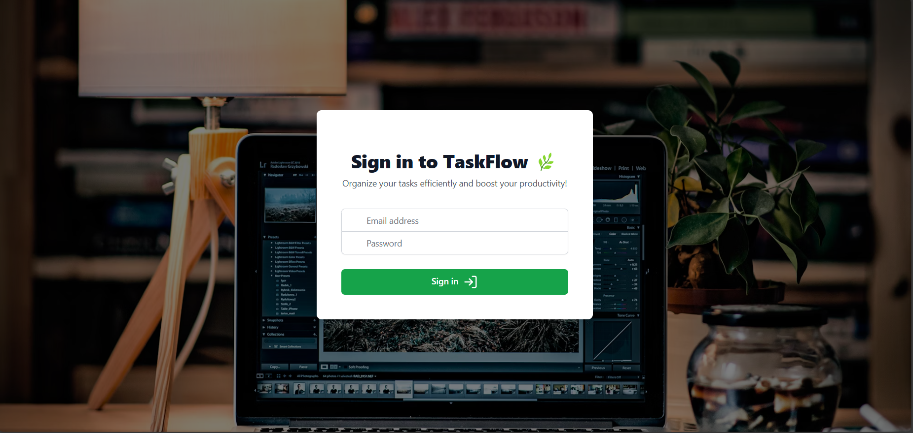
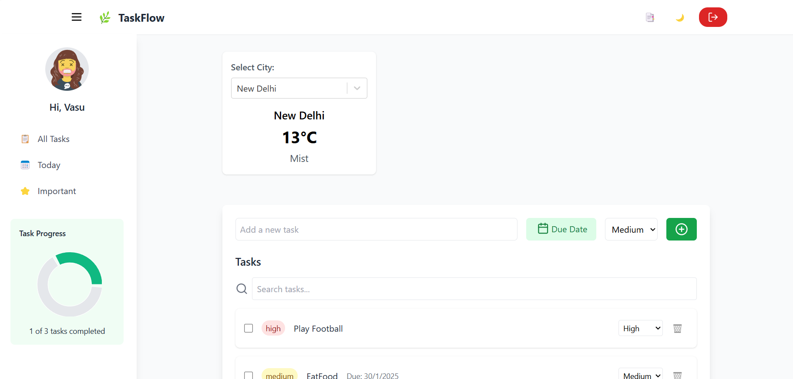

# TaskFlow Web App

[Deployed Link](https://taskflow-web.vercel.app)

## Project Description

TaskFlow is a web application designed to help users manage their tasks efficiently. It provides a user-friendly interface to create, update, track tasks and view weather report of your city. The app is built using React, ensuring fast performance and a smooth user experience.

## Features

- Create, update, and delete tasks
- Weather API support for Major Cities
- Organize tasks by priorities
- Set due dates
- Mark tasks as completed
- Responsive design for mobile and desktop

## Setup

1. Clone the repository:
    ```sh
    git clone https://github.com/your-username/taskflow-web-app.git
    cd taskflow-web-app
    ```

2. Install dependencies:
    ```sh
    npm install
    ```

3. Create a `.env` file in the root directory and add your API keys:
    ```env
    REACT_APP_WEATHER_API_KEY=your_weather_api_key
    ```

4. Start the development server:
    ```sh
    npm start
    ```

5. Open your browser and navigate to `http://localhost:3000`.

## Running Tests

To run tests, use the following command:
```sh
npm test
```

## Build for Production

To create a production build, use the following command:
```sh
npm run build
```

## Screenshots



## Overview of Features

### Task Management
- **Create Tasks:** Add new tasks with a title, description, and priority.
- **Update Tasks:** Edit existing tasks to update their details.
- **Delete Tasks:** Remove tasks that are no longer needed.
- **Organize by Priorities:** Sort tasks based on their priority levels.
- **Set Due Dates:** Assign due dates to tasks to keep track of deadlines.
- **Mark as Completed:** Mark tasks as completed once they are done.

### Weather Report
- **Weather API Integration:** Fetch and display the current weather for major cities.
- **Responsive Design:** Ensure the weather report is accessible on both mobile and desktop devices.

